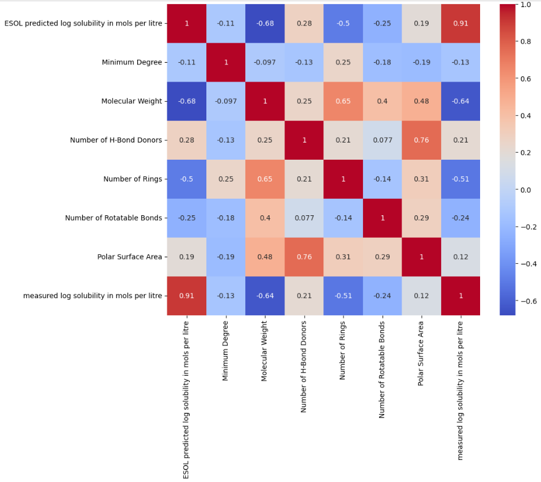
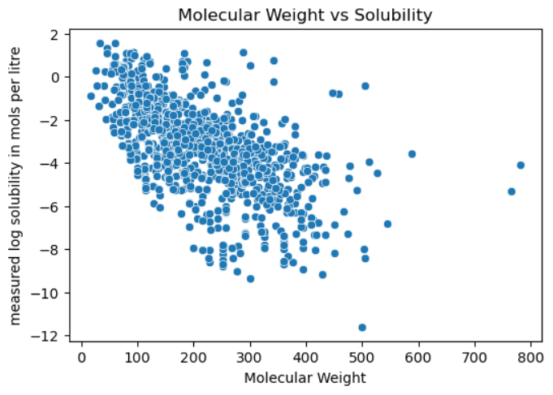
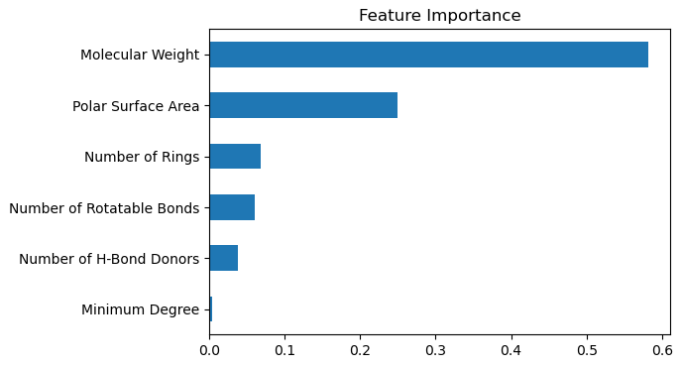

# 📊 Aqueous Solubility Prediction

## 📌 Overview

본 프로젝트는 분자 구조 기반 feature를 활용하여 **용해도(solubility)**를 예측하는 것을 목표로 한다.

단순 상관관계 분석은 변수 간 복잡한 관계를 충분히 설명하지 못하며,
특히 변수 간 상호작용과 비선형 패턴이 존재할 경우 한계가 있다.

이에 따라 다양한 feature 조합과 머신러닝 모델을 비교하여,
예측 성능에 가장 효과적인 변수 구성과 모델을 도출하고자 하였다.

---

## 🎯 Objectives

* 분자 구조 기반 feature가 용해도에 미치는 영향 분석
* 다양한 머신러닝 모델 성능 비교
* feature 선택이 모델 성능에 미치는 영향 분석
* 효율적인 feature 조합 도출

---

## 📂 Dataset

* **Target**

  * measured log solubility in mols per litre

* **Features**

  * Molecular Weight
  * Number of Rings
  * Number of Rotatable Bonds
  * Number of H-Bond Donors
  * Polar Surface Area
  * Minimum Degree

---

## 🔍 Exploratory Data Analysis
### Correlation Heatmap


### Feature Relationships
  
  
* 분자 크기가 클수록 용해도 감소
* 고리 수가 많을수록 용해도 감소
* 회전 결합 수 증가 → 용해도 감소
* 수소결합 증가 → 용해도 증가

👉 그러나 단순 상관관계만으로는 일부 변수의 영향을 충분히 설명하기 어려웠으며,
이는 변수 간 상호작용 및 비선형 관계가 존재할 가능성을 시사한다.

---

## ⚙️ Modeling Approach

### Feature 구성

* **Core**: 핵심 구조 변수
* **All**: 전체 변수
* **Reduced**: 중복/불필요 변수 제거
* **Top2**: 최소 변수 기반 비교 모델

### 모델

* Linear Regression
* Random Forest
* XGBoost

---

## 📊 Results

| 모델                     | MSE       | R²        |
| ---------------------- | --------- | --------- |
| Linear Regression      | 1.47      | 0.689     |
| RandomForest (Core)    | 1.25      | 0.735     |
| RandomForest (All)     | 0.825     | 0.825     |
| RandomForest (Reduced) | **0.819** | **0.827** |
| XGBoost                | 0.881     | 0.814     |
  
---
  
## 🔍 Model Interpretation



* 중요한 변수 확인
* 변수 간 상호작용 해석
  
---
  
## 🔍 Key Insights

* 일부 변수는 상관관계는 높지만 중요도는 낮게 나타남
  → 다른 변수와 정보가 중복되어 모델에서 기여도가 감소

* 반대로 상관관계는 낮지만 중요도가 높은 변수 존재
  → 변수 간 상호작용을 통해 예측에 기여

* 선형 모델보다 트리 기반 모델의 성능이 우수
  → 데이터에 비선형 구조가 포함되어 있음을 확인

---

## ✅ Conclusion
- RandomForest (Reduced) 모델이 가장 우수한 성능을 보임  
  → R² 기준 0.827로, Core 모델(0.735) 대비 약 12% 성능 향상  

- 불필요한 변수를 제거하면서도 성능을 개선할 수 있음을 확인  
- 단순 상관관계 기반 분석에는 한계가 있으며, 변수 간 상호작용이 중요한 역할을 함  
- 선형 모델 대비 트리 기반 모델이 더 높은 성능을 보여, 데이터에 비선형 구조가 존재함을 확인  

👉 단순히 많은 feature를 사용하는 것이 아니라,  
   데이터 특성에 맞는 feature 선택과 모델 구조가 예측 성능을 결정하는 핵심 요소임을 확인  
  
---
  
## 🚀 실행 방법

### 1. 저장소 클론

```bash
git clone https://github.com/mars7421/molecular-property-prediction.git
cd molecular-property-prediction
```

---

### 2. 가상환경 설정

#### ✔ Conda 사용 (권장)

```bash
conda create -n mol-env python=3.10
conda activate mol-env
pip install -r requirements.txt
```

#### ✔ venv 사용

```bash
python -m venv venv
source venv/bin/activate  # Windows: venv\Scripts\activate
pip install -r requirements.txt
```

---

### 3. 노트북 실행

```bash
jupyter notebook
```

`notebooks/` 폴더 내 파일을 실행하면 됩니다.
